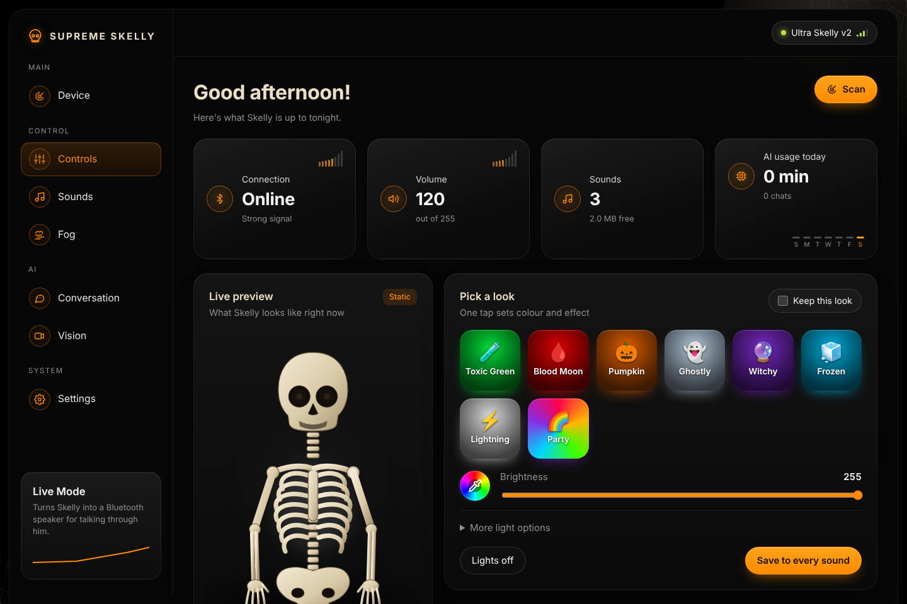
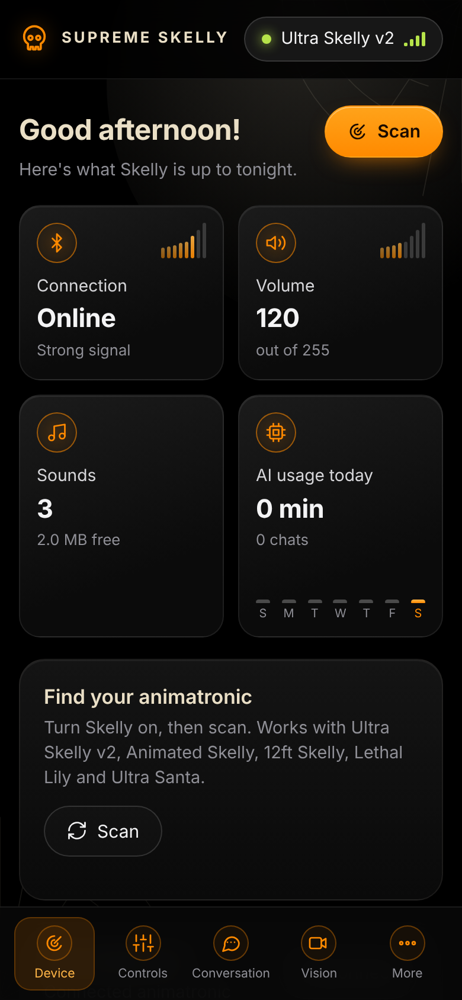
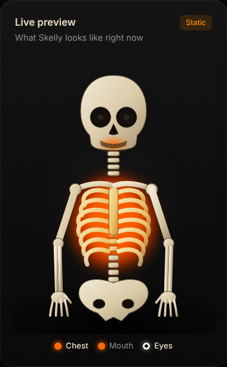
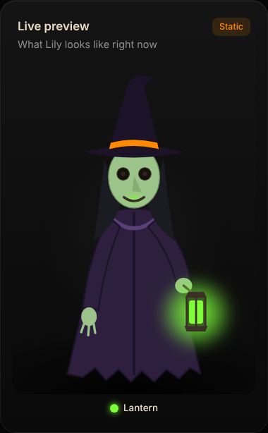
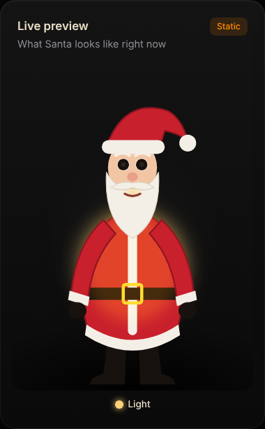
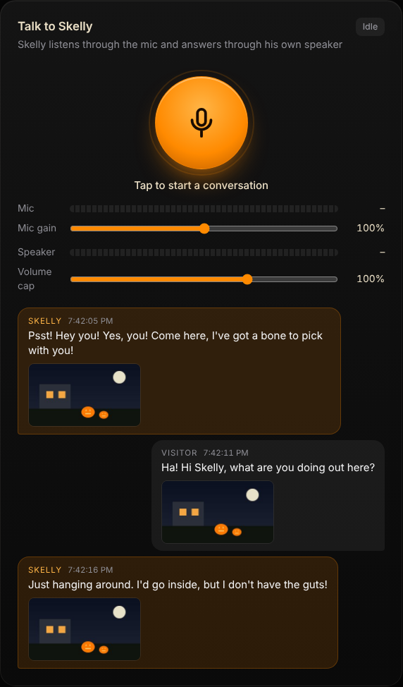

# Supreme Skelly 💀

Bring your Home Depot Skelly to life from your phone. Supreme Skelly runs on a small
always-on computer next to your animatronic and gives you a web page where you can move
him, change his eyes and lights, play sounds, have him **talk with visitors using AI**, and
**greet people he sees on camera**.

Works with the Skelly-family Bluetooth animatronics: Ultra Skelly v2, Animated Skelly,
12 ft Skelly, Lethal Lily and Ultra Santa.

<p align="center">
  
  &nbsp;
  
</p>

## Every model is its own character

Supreme Skelly notices which animatronic it's talking to and becomes that character: the live
preview draws it, and until you write your own personality it introduces itself, greets
visitors and calls people over as that character.

<p align="center">
  
  
  
</p>

- **Skelly** (Ultra Skelly v2, Animated Skelly, 12 ft Skelly): a spooky, punny skeleton.
- **Lethal Lily**: a cackling witch who calls visitors "dearie". Her lantern glows in the drawing.
- **Ultra Santa**: a jolly Santa who counts down to Christmas instead of Halloween.

The moves, lights and eye choices on the Controls page always match the connected model.


- **Your Skelly** (switched on, within Bluetooth range).
- **A small Linux computer** that stays on: any mini PC (an Intel N100 box is plenty) or a
  spare laptop running **Ubuntu Server 24.04** or **Debian 12**. It needs Bluetooth; a USB
  Bluetooth dongle works if it has none.
- Optional, for conversations: a **USB microphone** near Skelly and an account with one of
  the AI services below.
- Optional, for Vision: a **USB webcam**, any camera with an RTSP stream, or **UniFi Protect**.
- Optional, for fog: a **Wi-Fi relay** (Shelly, Sonoff in LAN mode, Tasmota or ESPHome) wired
  across the fog button on your fog machine's remote.

### Hardware we've used that works

This is the setup the project is built and tested on every day. Other hardware should work too.

| What | We use | Notes |
|---|---|---|
| Animatronic | Home Depot **6 ft Ultra Skelly v2** | Connects and reconnects on its own. Lily, Santa and the 12 ft Skelly are supported but not tested on real hardware yet. |
| Mini PC | **Beelink Mini S12 Pro** (Intel N100) with Ubuntu Server 24.04 | Runs everything, including face recognition on one camera, without breaking a sweat. |
| Bluetooth | **Realtek RTL8761B USB Bluetooth dongle** | Stronger signal than the mini PC's built-in radio. Pick it in Settings > Bluetooth radio. |
| Getting the radio close to Skelly | **USB-over-Ethernet extender** (4 USB 2.0 ports, up to 50 m over one Cat5/6 cable, no drivers) | Puts the Bluetooth dongle and mic right next to Skelly while the mini PC stays indoors. If the dongle freezes, turn off USB power saving (see Settings for tinkerers). |
| Microphone | A plain **USB microphone** on the extender | |
| Speaker | **Skelly's own Bluetooth speaker** | Paired automatically. Extra Bluetooth speakers can play along. |
| Cameras | **UniFi Protect** cameras on a UniFi NVR | No live video decoding needed: Protect's own person detection and snapshots drive Vision. |
| Fog *(being tested)* | **AGPTEK LED-500** fog machine + **Shelly Plus Uni** relay on a 12 V adapter | The relay is wired across the fog button on the machine's remote. See the [fog guide](docs/fog.md). |

## Quick start (about 10 minutes)

1. On the mini PC, open a terminal (or SSH in) and paste this one line:

   ```bash
   curl -fsSL https://raw.githubusercontent.com/WJDDesigns/supreme-skelly/main/get.sh | bash
   ```

   It installs everything it needs (Bluetooth, sound, Docker), then starts Supreme Skelly.
   It will ask for your password once so it can install things.

2. When it finishes it prints an address like `http://my-mini-pc.local`. Open it on your
   phone or computer (same Wi-Fi).

3. The first time, it asks you to **pick a password** for the page and confirms your
   **time zone**. That's it.

4. **Switch Skelly on.** He's found and connected automatically, and everything comes
   back on its own after a power cut or reboot.

**Updates are automatic.** The mini PC checks for a new version every 15 minutes and installs
it by itself, keeping your settings, keys and faces. The version you're on is shown at the
bottom of the page and in **Settings > System**, where you can also tap **Update now** or switch
automatic updates off. (Running the install line again also updates.)

## Making him talk

Open **Conversation** and pick an "AI brain". You can switch any time:

| Option | You need | Notes |
|---|---|---|
| ElevenLabs agent | ElevenLabs key | Most natural; uses ElevenLabs credits |
| OpenAI Realtime | OpenAI key | Fast, one service does everything |
| Claude | Anthropic key + an ElevenLabs or OpenAI key for voice | Cheapest per chat; short spoken replies |

Add keys under **Settings > API keys**. Each one has a link and a one-line "how to get it".
Keys never leave the mini PC, and the page only ever shows their last 4 characters.
**Settings > Usage** shows what each night cost, and **Quiet hours** keeps him from chatting
at night. Conversations always end after a few minutes so nothing can run up a bill, and a
chat Skelly started himself ends shortly after he stops talking if nobody answers. If your
ElevenLabs credits run out, he says so and carries on with OpenAI's voice and hearing.



Every chat bubble shows **when it was said and what the camera saw at that moment**, so you can
look back and see why he said what he did. Tap a picture to see it big. Pictures stay on the
mini PC and are deleted after a week. Saved recordings show the same bubbles.

**Settings > Sound** picks the mic, Skelly's speaker and any extra Bluetooth speakers, with level
meters and volume caps. **Keep speakers awake** plays silence so Bluetooth speakers don't chime
each time he starts talking.
<br clear="right">

## Seeing visitors (Vision)

Open **Vision** and pick where the picture comes from: a USB webcam, an RTSP camera link,
or UniFi Protect (add a Protect API key in Settings and your console's address on the
Vision page, then tick which cameras count). Skelly can then notice people, call passers-by
over, and greet people by name once they've told him (or welcome them back by name next time).

**Check with AI** has an AI look at each picture to confirm it's a person and describe them,
for costume compliments. It costs a little per look. Switch it off for a free mode: with UniFi
Protect, Skelly then goes by UniFi's own person detection. **Recent sightings** lists everyone
the cameras spotted, with their picture and what Skelly did about it.

**Face memory stays on the mini PC:** faces are recognised on the mini PC itself and never
sent anywhere. You can rename or forget anyone, or everyone, on the Vision page. Recording
faces may be regulated where you live; check your local rules and consider a sign telling
visitors they're on camera.

## Fog on cue

The **Fog** page drives a fog machine through a Wi-Fi relay on your network (no cloud).
Wire the relay's dry-contact output across the fog button on the machine's **battery
remote**, not across the machine's power: the heater has to stay on to stay warm, and the
remote's button is low voltage. Some wired remotes carry mains voltage; leave those alone.

Then pick the relay type and its IP address, tap **Check connection** and **Fog!**. Automatic
fog can fire when a visitor walks up, and can keep the fog topped up: pick which camera
watches the fog (the Vision camera or any UniFi Protect camera), draw a fog area on
the picture, tap **Calibrate** while there's no fog, and the fog meter shows how
thick it is. Every automatic burst respects a rest time, an hourly limit and quiet hours.


The **[fog guide](docs/fog.md)** has a wiring diagram for a Shelly Plus Uni and step-by-step setup.

## Make it yours

**Settings > Wallpaper** has wallpapers (graveyard, pumpkin patch, spider web and more) and a
see-through setting for the cards. The Device page shows today's AI use with a week graph,
and **Settings > Usage** breaks it down by night.

## Security

- **Password:** set on first run; change or turn it off in **Settings > Password and time zone**.
  Without one, anyone on your Wi-Fi can open the page.
- **Keep it on your home network.** Don't forward its port to the internet. For remote
  access use a VPN such as Tailscale or WireGuard.
- **Your data stays local:** settings, API keys (readable only by root), faces and
  recordings live in the `data` folder on the mini PC and nowhere else.
- Requests from other websites can't control Skelly, even while your browser has the page open.

**Forgot the password?** On the mini PC run:

```bash
sudo rm /opt/supreme-skelly/data/auth.json
```

The page then opens without a password and you can set a new one in Settings.

## Other ways to run it

**Windows (no Docker):** install [Python](https://www.python.org/downloads/) (tick "Add
python.exe to PATH"), download this project, then double-click `start-windows.bat`. It
opens the page at `http://localhost:8420`. Conversations and Vision work best on Linux.

**Already cloned it?** Run `./install.sh` from the folder.

**Try it without a Skelly:** set `SKELLY_SIMULATE=1` in `docker-compose.yml` for a fake one.

**Fresh mini PC from a USB stick (advanced, experimental):** `deploy/usb/make-usb-image.sh`
builds an Ubuntu installer that wipes the disk and sets everything up unattended. It asks
you for the mini PC's login password while building.

## Settings for tinkerers

These go in `docker-compose.yml` (or the environment when running natively).

| Setting | Default | |
|---|---|---|
| `SKELLY_PORT` | `8420` | Web page / API port |
| `SKELLY_EXTRA_PORTS` | `80` in Docker | More ports serving the same page |
| `SKELLY_SIMULATE` | `0` | `1` = fake device for testing |
| `SKELLY_AUTOCONNECT` | `1` | Find and connect to Skelly automatically |
| `SKELLY_BT_ADAPTER` | (auto) | Which Bluetooth radio, by MAC or `hci0`; also pickable in Settings > Bluetooth radio |
| `SKELLY_DATA_DIR` | `/data` in Docker | Where settings, keys and faces are kept |
| `SKELLY_LOG_LEVEL` | `INFO` | |

**Bluetooth through a USB-over-Ethernet extender** (to keep the radio close to Skelly)
works. If the dongle freezes after a few minutes, USB power saving is the usual cause: add
`usbcore.autosuspend=-1` to `GRUB_CMDLINE_LINUX_DEFAULT` in `/etc/default/grub`, then run
`sudo update-grub` and reboot.

## Troubleshooting

- **Page won't open at `.local`:** use the IP address the installer printed instead. Some
  routers don't pass `.local` names between networks.
- **Skelly isn't found:** make sure he's on and not connected to the phone app, then press
  Scan on the Device page. With two Bluetooth radios, pick the right one in Settings > Bluetooth radio.
- **No sound from Skelly when talking:** Settings > System > Restart sound.
- **See what's happening:** `sudo docker logs -f supreme-skelly`

## Develop

```bash
pip install -e ".[dev]"
pytest
ruff check .
SKELLY_SIMULATE=1 supreme-skelly   # then open http://localhost:8420
```

Plain Python (FastAPI) service in `server/skelly`, a no-build web page in `web/`.

**Publishing a release:** bump `VERSION` (and `version` in `pyproject.toml`) and merge to
`main`. GitHub Actions tags and publishes the release, and every box with automatic updates
installs it.
Protocol notes are in [docs/protocol.md](docs/protocol.md).

## Credits and license

Protocol knowledge builds on the community reverse engineering in
[martinecker/SkellyUltraWebController](https://github.com/martinecker/SkellyUltraWebController)
(ISC) and [martinecker/SkellyUltra](https://github.com/martinecker/SkellyUltra). Face
models come from [OpenCV Zoo](https://github.com/opencv/opencv_zoo), the free local voice
from [kokoro-onnx](https://github.com/thewh1teagle/kokoro-onnx).

MIT licensed (see [LICENSE](LICENSE)). Not affiliated with Home Depot or the makers of any
other Skelly app. Use at your own risk.
