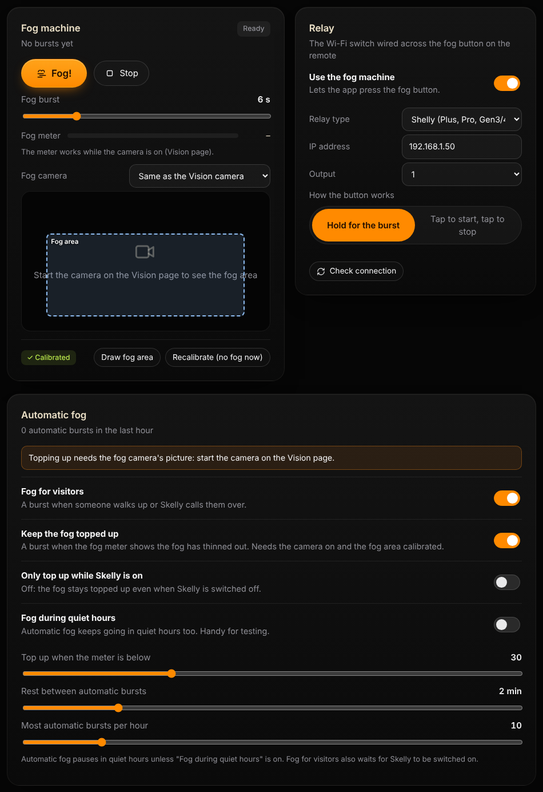
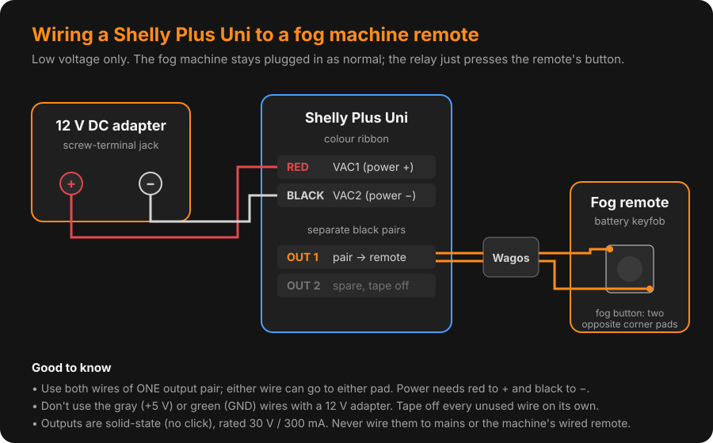

# Fog on cue

Supreme Skelly can fire your fog machine when a visitor walks up, and keep the fog topped up
by watching it on a camera. It does this through a small Wi-Fi relay on your home network.
There's no cloud account and nothing to pay for.

## What you need

- A fog machine with a **battery remote** (a keyfob). Most cheap 400–500 W machines come with one.
- A **Wi-Fi relay** with a dry-contact (potential-free) output. Any of these work:
  - **Shelly** Plus Uni, Plus 1, Pro or Gen3/Gen4 (recommended), or a Shelly Gen 1
  - **Sonoff** in LAN / DIY mode
  - Anything running **Tasmota** or **ESPHome**
  - Anything you can switch with a plain web link
- A power supply for the relay. A Shelly Plus Uni takes 9–28 V DC; a 12 V adapter with a
  screw-terminal jack is the easy option.
- Two short wires soldered to the remote's fog button, and lever connectors (such as Wago 221)
  to join them to the relay.

## Why the remote, not the machine

The relay presses the remote's fog button for you. Don't switch the fog machine's power with
the relay: the heater has to stay on to stay hot, and the machine side runs on mains voltage.
The keyfob runs on a small battery, so wiring to it is safe.

Some fog machines also have a **wired** remote. Those can carry mains voltage, so leave them
alone and use the battery keyfob.

## Wiring a Shelly Plus Uni

1. **Power:** the colour ribbon's **red** wire (VAC1) goes to **+** on the 12 V adapter and
   its **black** wire (VAC2) goes to **−**. Don't use the gray (+5 V) or green (GND) wires.
2. **Remote:** open the keyfob and find the fog button. Most keyfobs use tiny square
   surface-mount switches with four legs; solder one wire to each of two **diagonally
   opposite** corner legs. A small dab of solder on each is enough.
3. Join those two wires to **one** of the Uni's separate black output pairs (OUT 1 or OUT 2)
   with lever connectors. Either wire can go to either side. Use both wires of the same pair.
4. Tape off every unused wire on its own, including the spare output pair, so nothing can touch.
5. Strip about 11 mm of each wire for the lever connectors and twist the strands tight.

The Uni's outputs are solid-state, rated 30 V / 300 mA, so they don't click. Keep the keyfob's
battery in: the relay presses the button, and the keyfob still sends the signal.

## Setting it up

1. Add the relay in its own app (for Shelly, the **Shelly Smart Control** app) and put it
   on the **same Wi-Fi network as the mini PC**. Shelly only joins 2.4 GHz Wi-Fi.
2. Don't set a login password on the relay; the Fog page can't sign in to one.
3. Give the relay a fixed IP address in your router so it never moves.
4. Open **Fog** in Supreme Skelly, turn on **Use the fog machine**, pick the **Relay type**,
   type in its **IP address** and choose the **Output** you wired.
5. Tap **Check connection**, then **Fog!**. You'll see the output switch on in the relay's
   app and turn off by itself after the burst. If nothing happens, try the other output.

**How the button works:** most keyfobs fog only while the button is held, so leave it on
**Hold for the burst**. If yours starts fogging on one press and stops on the next, choose
**Tap to start, tap to stop**.

With Shelly and Tasmota relays, the relay lets go of the button on its own when the burst
time runs out, even if the mini PC drops off the network in the middle of a burst.

## Automatic fog

- **Fog for visitors** fires a burst when someone walks up or Skelly calls them over.
- **Keep the fog topped up** watches the fog on a camera and fires a burst when it thins out:
  1. Pick the **Fog camera**: the Vision camera or any UniFi Protect camera that faces the fog.
  2. Tap **Draw fog area** and drag a box over where the fog sits.
  3. While there's **no fog**, tap **Calibrate**.
  4. The fog meter now shows how thick the fog is. Set **Top up when the meter is below** to taste.

Topping up works on its own, even while Skelly is switched off, so the graveyard stays foggy
all evening. Turn on **Only top up while Skelly is on** if you'd rather it followed Skelly.
Fog for visitors is part of Skelly's show, so it only fires while Skelly is on.

Every automatic burst respects the **rest time** between bursts, the **hourly limit** and
**quiet hours**. To try automatic fog during quiet hours (say, testing in the afternoon), turn
on **Fog during quiet hours**. The **Fog!** and **Stop** buttons always work.

Once the fog area is calibrated, a green **✓ Calibrated** shows under the picture, and the
button changes to **Recalibrate**. Recalibrate if the light changes a lot or the camera moves.

## Troubleshooting

| What you see | Try this |
|---|---|
| "Couldn't reach the relay" | Check the IP address and that the relay is on the same network as the mini PC. |
| "The relay wants a password" | Turn off the relay's login in its app. |
| The output switches but no fog | Check the wires on the keyfob, the keyfob's battery, and that the machine has warmed up. |
| Fog only puffs for a moment | Switch **How the button works** to the other option. |
| The fog meter shows "–" | Turn the camera on, draw a fog area and calibrate with no fog. |
| No automatic fog | Read the orange note in the **Automatic fog** card. It says what automatic fog is waiting for (Skelly switched off, quiet hours, no fog area, not calibrated, no camera picture) and why the last automatic burst didn't happen (for example "resting between bursts"). |
